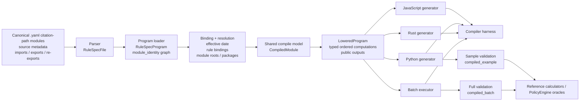

# Compiler Architecture

This page is the shortest accurate map of what `rulespec-compile` is doing today.

Use it as the canonical high-level reference for:

- how `.yaml` rules flow through the compiler
- which parts of the stack are stable enough to build around
- which seams still need product or architecture guidance

If this gets mirrored onto `axiomfoundation.org`, mirror this page rather than
maintaining a separate architecture description.

## End-to-end flow

## What Each Layer Means

### 1. Rule source

The source of truth is checked-in `.yaml` files. For canonical RuleSpec trees,
`module_identity` comes from the `statutes/...`, `regulations/...`, or
`policies/...` path. For ad hoc files outside those roots, it falls back to
the file leaf name. That identity shows up in imports, binding keys, lowered
bundles, and generated citation metadata.

### 2. Parse + graph assembly

`RuleSpecFile` parses one file. `RuleSpecProgram` loads the file graph, resolves imports,
applies export surfaces, and enforces identity rules such as unique canonical
module identities within one loaded program.

### 3. Resolution

Before code generation, the compiler resolves:

- temporal entries through `--effective-date`
- source-only external rules through explicit bindings
- module-root / package import paths
- selected public outputs into the reachable subgraph

This is the layer where Axiom-facing source resolution will eventually need to
plug in.

### 4. Shared compile model

`CompiledModule` is the backend-neutral compile surface produced after graph and
binding resolution. It knows the reachable computations, dependencies,
external-rule/input requirements, output bindings, and provenance.

### 5. Lowered bundle

`LoweredProgram` is the serializable artifact after resolution and pruning. It
is the real backend seam:

- generators consume it
- the batch executor consumes it
- the harness checks it
- validation is increasingly routed through it

This is the best place to reason about adding targets or external execution
engines.

### 6. Targets and execution lanes

Current downstream consumers:

- JavaScript generator
- Python generator
- Rust generator
- Pandas/NumPy batch executor
- compiler harness
- sample and full validation lanes

## Rust Backend Limitations

The Rust generator targets the current validated numeric/boolean subset. It is
the strictest of the three generators and will refuse to lower constructs it
cannot represent safely. Known gaps:

- **No string formula literals.** Lowering fails with a clear `CompilationError`
  when a `LiteralExpr` holds a string value or when a `BinaryExpr` has an
  inferred `string` kind (e.g. string concatenation or comparison-as-string).
  Use the Python or JavaScript backend for modules that need string-valued
  formulas.
- **Only the validated control-flow subset.** The Rust backend covers the same
  statement set as the Python/JS backends for the validated modules, but has
  not been exercised against the full language surface. Anything outside the
  validated subset should be treated as unsupported until explicitly added.
- **Scalar-or-indexed numeric external rules only.** The Rust generator assumes
  external rule schemas resolve to numeric scalars or indexed numeric tables,
  matching the current shared compile model.
- **Prebuilt binaries emit JS/Python only.** The shipped `rulespec-compile eitc`
  prebuilt invocation generates the JS and Python targets. The Rust target is
  available through the library API and CLI flags, but is not part of the
  default prebuilt output and may require the module to stay within the
  numeric/boolean subset above.

The rationale is intentional: the Rust path fails loudly outside its validated
subset rather than silently emitting code with surprising semantics. Broadening
the subset should be a deliberate decision (see Decision Seam D below).

## Stable vs In Progress

### Stable enough to build on

- `.yaml`-only source format
- canonical path-based `module_identity` for real RuleSpec trees
- local/imported module graph loading
- explicit exports, import aliases, selective imports, and re-exports
- shared lowered bundle
- JS / Python / Rust generation for the validated subset
- output-driven subgraph pruning
- compiler harness and shipped example oracle cases
- compiler-backed sample and full validation lanes

### Real but still intentionally narrow

- control flow support is limited to the validated subset
- external rule schemas are still scalar-or-indexed numeric tables
- Rust targets the current validated subset, not the full language
- workspace module/package resolution is local and explicit, not registry-based

### Still the main unfinished seams

- identity-aware external source resolution beyond ad hoc rule-binding bundles
- richer external rule index/domain metadata
- broader statement/runtime coverage in lowering and batch execution
- stronger public package/workspace metadata

## Decision Seams

These are the places where product or architecture guidance matters most.

### A. Rule identity policy

Question:
What exactly counts as the canonical RuleSpec identity path outside the current
`statutes/`, `regulations/`, and `policies/` roots?

Why it matters:
`module_identity` now flows into imports, bindings, lowered metadata, and
citations. Naming policy is no longer cosmetic.

### B. Validation oracle policy

Question:
Which outputs should be continuously checked against reference calculators,
which against PolicyEngine, and with what tolerance / fixture policy?

Why it matters:
The harness and validation lanes now exist, but “what counts as green” is a
policy decision as much as a technical one.

### C. Package/workspace model

Question:
Should RuleSpec libraries be addressed only by workspace aliases, or do they need a
stronger package manifest / versioned interface model?

Why it matters:
Import resolution works today, but the long-term authoring model for a larger
policy graph is still open.

### D. Supported RuleSpec subset

Question:
Which language features are actually worth supporting next, versus staying
explicitly unsupported?

Why it matters:
The current compiler is strongest when it fails loudly outside its validated
subset. Broadening that subset should be deliberate.

## How To Use This Page

If you want to guide the compiler without getting buried in implementation
details, the most useful feedback format is:

1. one or two hard constraints
2. one prioritized target outcome
3. one decision-seam preference from the list above

That is usually enough to choose the next milestone cleanly.
